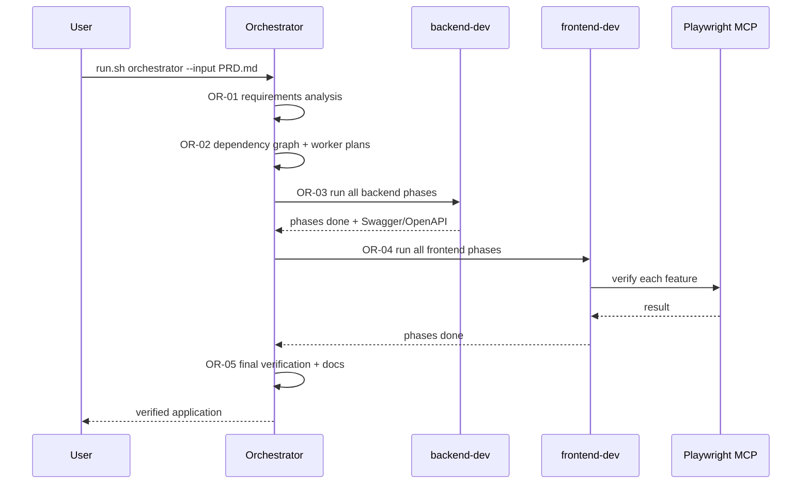
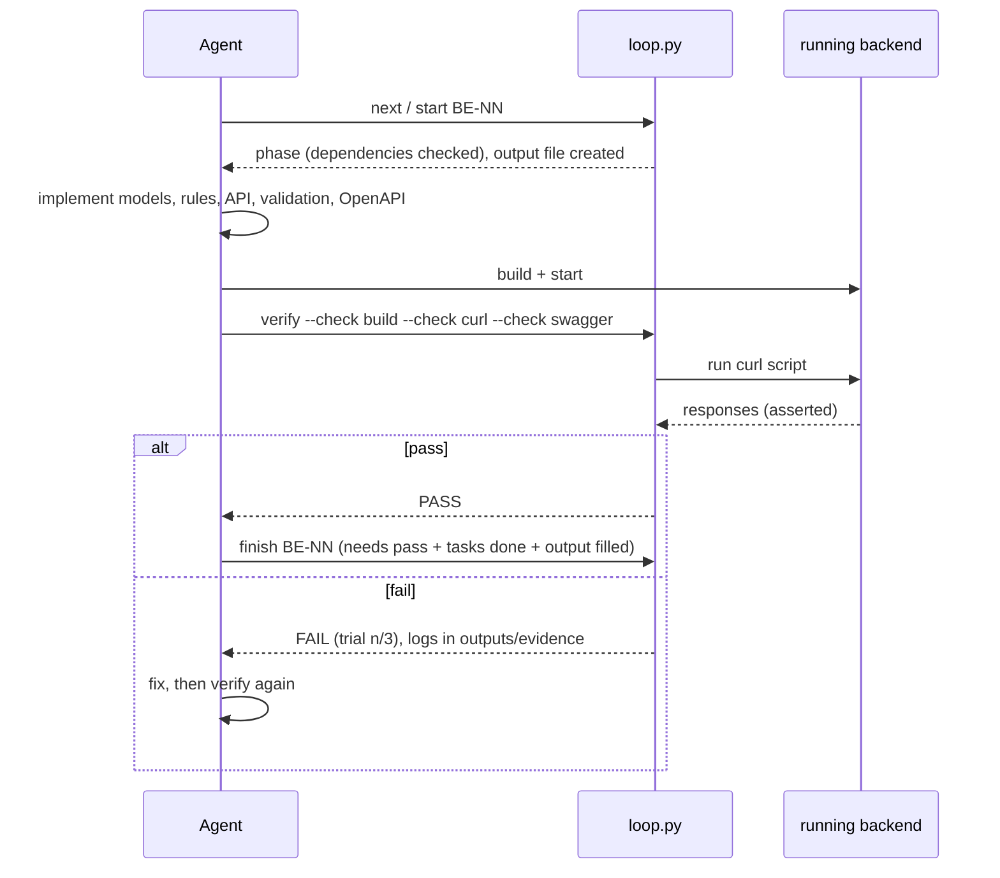
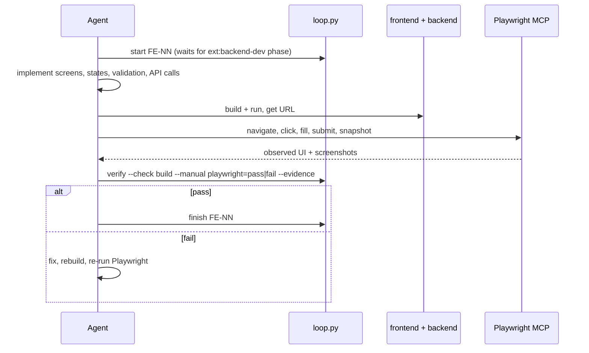
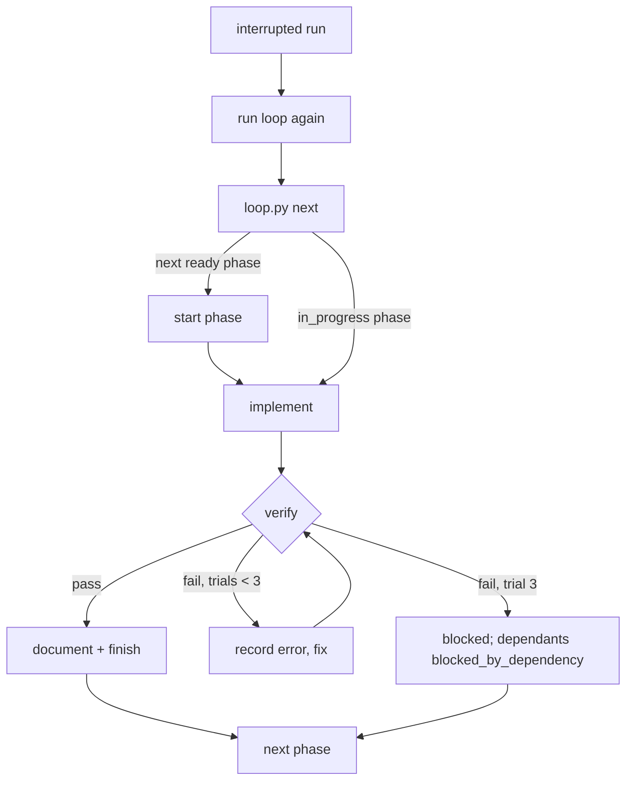
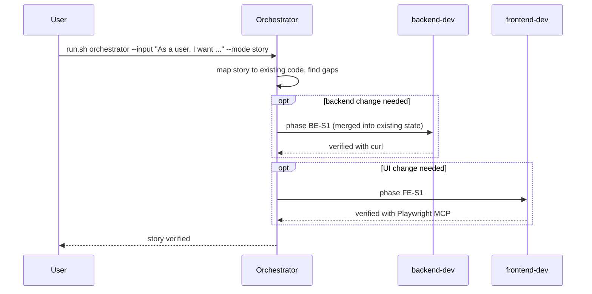

# QuickFlow

A personal productivity app covering tasks, habits, learning resources, time-boxed plans and a
dashboard. It is built with reusable **Claude Loops**. The requirements are in [PRD.md](PRD.md).

> The application has not been generated yet. Run the loops (below) to build it. The orchestrator's
> final phase adds install, run and test instructions and the Swagger and frontend URLs to this README.

## Prerequisites

- Claude Code CLI (`claude`)
- Python 3.8+, `curl`, `jq`
- Node.js 18+ and `npx` (for the Playwright MCP server in `.mcp.json`, and for the frontend)
- Whatever toolchain the backend loop picks; it records the stack in `docs/architecture.md`

## Repository layout

```
PRD.md                     requirements (source of truth)
loops/                     reusable Claude Loops + loops/_lib/loop.py state keeper
.mcp.json                  Playwright MCP server
.claude/settings.json      hook that logs every prompt to execution-tracking.csv
execution-tracking.csv     prompts / sessions / phases / verification results
backend/, frontend/, docs/ created by the loops
```

## Claude Loops

A Claude Loop is a reusable, file-based work cycle that a Claude Code agent follows to turn
requirements into verified code. Each loop has written instructions (`Loop-instructions.md`), and
`loops/_lib/loop.py` keeps its state. The script enforces the order of phases, the verification gate
and the 3-trial stop condition, so the agent can't mark work as done when it isn't. The loops don't
depend on any particular project, and they accept either a whole PRD or a single user story.

### Available loops

| Loop | Input | Verifies with | Output |
|---|---|---|---|
| `backend-dev` | PRD or user story | `curl` against the running backend, plus Swagger/OpenAPI | backend code, API docs, phase outputs |
| `frontend-dev` | PRD or story, plus the backend OpenAPI | Playwright MCP against the running UI | frontend code, phase outputs |
| `orchestrator` | PRD or user story | the state of both loops, then a final end-to-end check | analysis, dependency graph, final docs |

Every loop folder has the same layout:

```
<loop>/
├── Loop-instructions.md   how the loop works (read by the agent)
├── task.md                checklist per phase        (rendered from state)
├── progress.md            execution history per phase (rendered from state)
├── state/loop-state.json  machine-readable state, used to resume
└── outputs/               one phase-NN-<name>.md per phase + evidence/ logs
```

### How to run

```bash
loops/run.sh orchestrator --input PRD.md                          # full PRD, both loops
loops/run.sh orchestrator --input "As a user, I want ..." --mode story   # one user story
loops/run.sh backend-dev  --input PRD.md                          # only the backend
loops/run.sh frontend-dev --input PRD.md                          # only the frontend
loops/run.sh backend-dev  --input PRD.md --phase BE-02            # one phase
loops/run.sh orchestrator --resume                                # continue after an interruption
```

`run.sh` opens an interactive Claude Code session with the Playwright MCP server loaded from
`.mcp.json`. With `--headless` it runs unattended via `claude -p`. You can also skip the script:
open Claude Code in the repo and say *"Run the backend-dev loop on PRD.md"*.

### State, retries, verification

- **State:** `state/loop-state.json` holds the phase plan and, for each phase, the task status, timings,
  verification runs, failed-trial count, errors and fixes. `task.md` and `progress.md` are generated
  from it every time it changes.
- **Verification:** `loop.py verify` counts as one trial. Each `--check` command runs for real and its
  exit code decides pass or fail. For browser tests the agent records what Playwright MCP showed with
  `--manual playwright=pass|fail --evidence <screenshot>`. All logs go to `outputs/evidence/`.
- **Stop condition:** a phase ends when it has been verified, or after 3 failed trials. At that point it
  is marked `blocked` and the phases that depend on it become `blocked_by_dependency`. Independent
  phases keep running.
- **Resume:** run the loop again. `init` is idempotent, `next` returns the phase that is in progress or
  the next one that can run, and phases already done are skipped.
- **Tracking:** `execution-tracking.csv` gets a row for every prompt (added automatically by the
  `UserPromptSubmit` hook in `.claude/settings.json`) and for every phase start, verification and
  finish. The row holds the real Claude session ID, or `unavailable` if none is exposed.

### Sequence diagrams

#### Orchestrator, full PRD



#### backend-dev phase



#### frontend-dev phase



#### Retry and resume



#### Single user story


