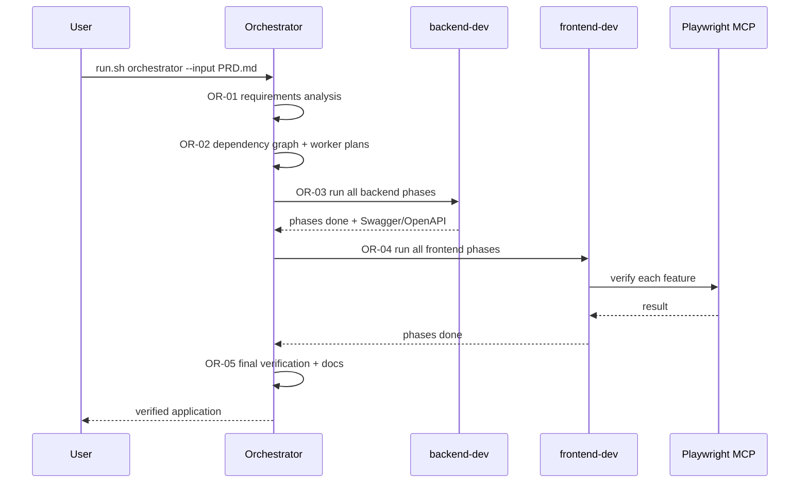
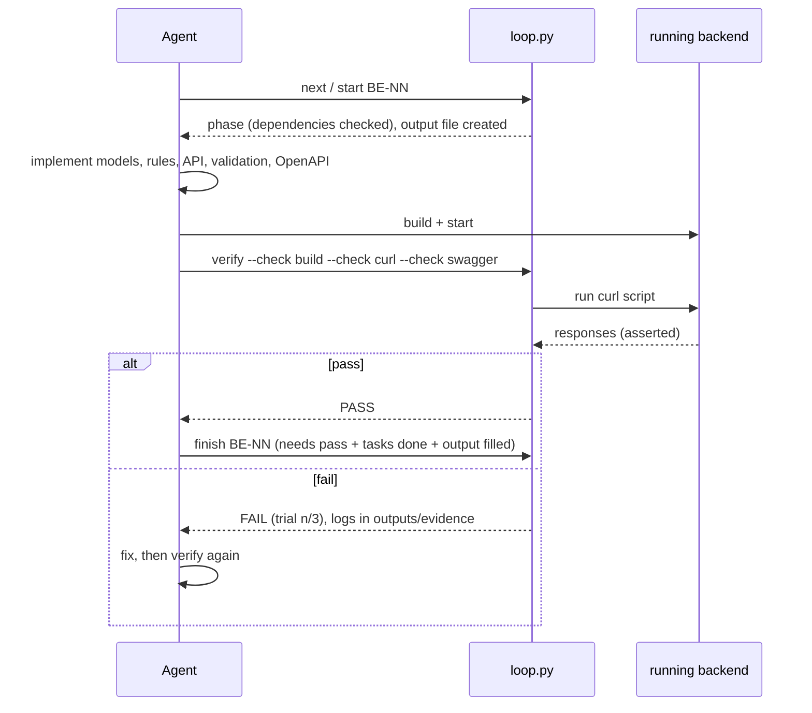
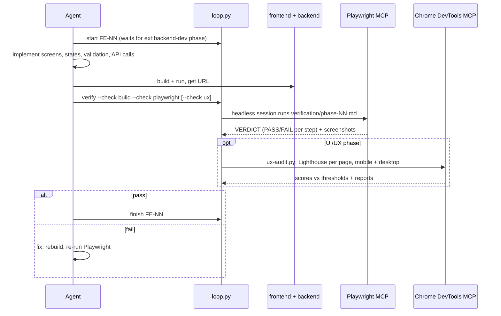
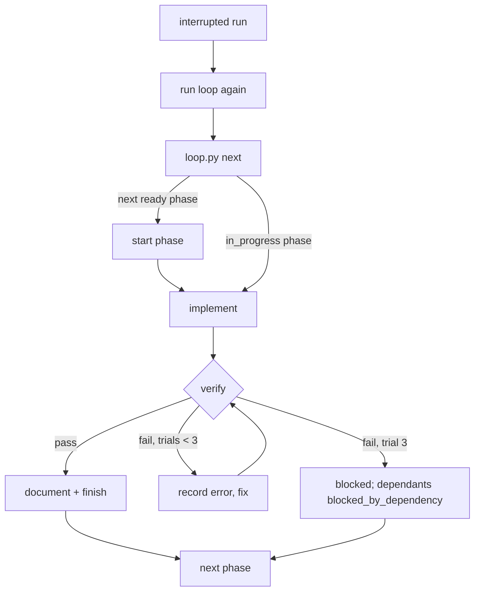
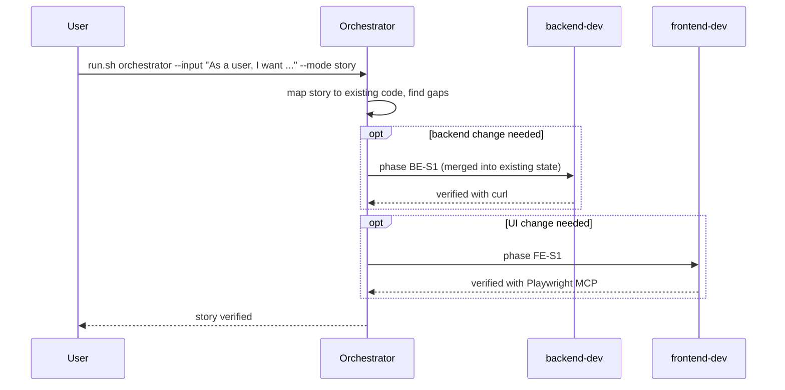

# QuickFlow

A personal productivity app covering tasks, habits, learning resources, time-boxed plans and a
dashboard. It is built with reusable **Claude Loops**. The requirements are in [PRD.md](PRD.md).

## Prerequisites

- JDK 21+ and Maven 3.6+ (backend)
- Node.js 20+ and npm (frontend, and `npx` for the MCP servers)
- Google Chrome (the Chrome DevTools MCP server uses it for the Lighthouse audit)
- Python 3.8+, `curl`, `jq` (loop tooling and curl verification scripts)
- Claude Code CLI (`claude`), to run the loops and the headless Playwright checks

## Run the application

```bash
# backend: http://localhost:8080 (data kept in backend/data/)
backend/run.sh start              # add --fresh for an empty in-memory database
backend/run.sh stop

# frontend: http://localhost:5173 (proxies /api to the backend)
cd frontend && npm install && npm run dev
```

| What | URL |
|---|---|
| Frontend | http://localhost:5173 |
| Swagger UI | http://localhost:8080/swagger-ui.html |
| OpenAPI JSON | http://localhost:8080/v3/api-docs (exported copy: `backend/openapi.json`) |
| Health | http://localhost:8080/actuator/health |

If `JAVA_HOME` points at an older JDK, `backend/run.sh` looks for a JDK 21 install. Configuration
is through environment variables: `PORT`, `DB_URL`, `DB_PASSWORD`, `CORS_ORIGINS`.

## Tests

```bash
backend/run.sh build                                     # compile + backend unit tests
bash loops/backend-dev/verification/phase-07.sh          # every curl script on fresh databases,
                                                         # latency check, Swagger export
cd frontend && npm run build                             # type-check + production build
bash loops/_lib/playwright-verify.sh loops/frontend-dev/verification/phase-01.md   # browser check
python3 loops/_lib/ux-audit.py --out /tmp/ux-audit                            # Lighthouse, all pages
```

The browser checks run the Playwright MCP server **headless** in a separate Claude Code session
with its own browser profile, so they never use your browser. Each scenario lists the steps and
the results it expects, and the script exits 0 only if every step passed. Screenshots are saved to
`loops/frontend-dev/outputs/evidence/`.

`ux-audit.py` runs Lighthouse through the Chrome DevTools MCP server, headless, on every page on
mobile and desktop. It exits 0 only when accessibility ≥ 95, best practices ≥ 95, SEO ≥ 90 and
CLS ≤ 0.1. You can change the pages, devices and thresholds with `--pages`, `--devices`, `--min`
and `--max-cls`. The design goals and findings behind these thresholds are in
[docs/ui-ux-plan.md](docs/ui-ux-plan.md).

## Repository layout

```
PRD.md                     requirements (source of truth)
backend/                   Spring Boot API (run.sh, openapi.json)
frontend/                  React + TypeScript app
docs/architecture.md       stack and structure decisions
docs/ui-ux-plan.md         UI/UX design direction, audit findings and the UI/UX phases
loops/                     Claude Loops: orchestrator, backend-dev, frontend-dev, _lib (loop.py, helpers)
.mcp.json                  MCP servers: Playwright, Chrome DevTools, Context7 (browsers headless)
.claude/settings.json      hook that logs every prompt to execution-tracking.csv
execution-tracking.csv     prompts / session ids / phases / verification results
```

## Claude Loops

A Claude Loop is a reusable, file-based work cycle that a Claude Code agent follows to turn
requirements into verified code. Each loop has written instructions (`Loop-instructions.md`), and
`loops/_lib/loop.py` keeps its state. The script enforces the order of phases, the verification gate
and the 3-trial stop condition, so the agent can't mark work as done when it isn't. The loops don't
depend on any particular project, and they accept either a whole PRD or a single user story.

### Available loops

| Loop | Input | Verifies with | Output |
|---|---|---|---|
| `backend-dev` | PRD or user story | `curl` against the running backend, plus Swagger/OpenAPI | backend code, API docs, phase outputs |
| `frontend-dev` | PRD or story, plus the backend OpenAPI | Playwright MCP against the running UI; Lighthouse via Chrome DevTools MCP for UI/UX phases | frontend code, UI/UX plan, phase outputs |
| `orchestrator` | PRD or user story | the state of both loops, then a final end-to-end check | analysis, dependency graph, final docs |

Every loop folder has the same layout:

```
<loop>/
├── Loop-instructions.md   how the loop works (read by the agent)
├── task.md                checklist per phase        (rendered from state)
├── progress.md            execution history per phase (rendered from state)
├── state/loop-state.json  machine-readable state, used to resume
└── outputs/               one phase-NN-<name>.md per phase + evidence/ logs
```

### How to run

```bash
loops/run.sh orchestrator --input PRD.md                          # full PRD, both loops
loops/run.sh orchestrator --input "As a user, I want ..." --mode story   # one user story
loops/run.sh backend-dev  --input PRD.md                          # only the backend
loops/run.sh frontend-dev --input PRD.md                          # only the frontend
loops/run.sh backend-dev  --input PRD.md --phase BE-02            # one phase
loops/run.sh orchestrator --resume                                # continue after an interruption
```

`run.sh` opens an interactive Claude Code session with the MCP servers from `.mcp.json` loaded.
The servers are:

- `playwright`, which drives the browser for scenarios;
- `chrome-devtools`, for Lighthouse, emulation and performance traces;
- `context7`, which supplies current library documentation.

Both browser servers run headless with an isolated profile. With `--headless` it runs unattended via `claude -p`. You can also skip the script:
open Claude Code in the repo and say *"Run the backend-dev loop on PRD.md"*.

### State, retries, verification

- **State:** `state/loop-state.json` holds the phase plan and, for each phase, the task status, timings,
  verification runs, failed-trial count, errors and fixes. `task.md` and `progress.md` are generated
  from it every time it changes.
- **Verification:** `loop.py verify` counts as one trial. Each `--check` command runs for real and its
  exit code decides pass or fail. Browser tests run through `loops/_lib/playwright-verify.sh`, which
  drives the Playwright MCP server in a headless child session (it never uses your browser) and exits 0
  only when every scenario step passed. UI/UX phases also run `loops/_lib/ux-audit.py`, a
  Lighthouse gate through the Chrome DevTools MCP server, and re-run earlier scenarios to catch
  regressions. All logs, screenshots and reports go to `outputs/evidence/`.
- **Stop condition:** a phase ends when it has been verified, or after 3 failed trials. At that point it
  is marked `blocked` and the phases that depend on it become `blocked_by_dependency`. Independent
  phases keep running.
- **Resume:** run the loop again. `init` is idempotent, `next` returns the phase that is in progress or
  the next one that can run, and phases already done are skipped.
- **Tracking:** `execution-tracking.csv` gets a row for every prompt (added automatically by the
  `UserPromptSubmit` hook in `.claude/settings.json`) and for every phase start, verification and
  finish. The row holds the real Claude session ID, or `unavailable` if none is exposed.

### Sequence diagrams

#### Orchestrator, full PRD



#### backend-dev phase



#### frontend-dev phase



#### Retry and resume



#### Single user story


