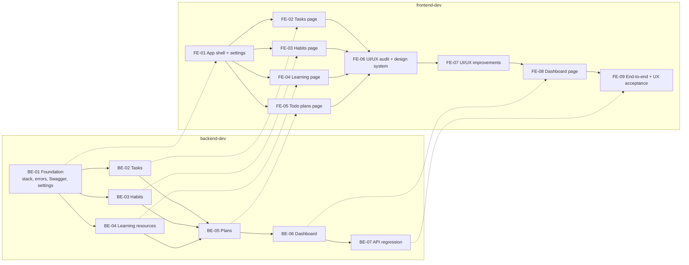

# OR-02 Dependency graph

## Requirements covered

- PRD.md: all 97 requirement IDs from OR-01 are assigned to at least one worker phase

## Tasks

- T1 Build the dependency graph
- T2 Write backend-dev plan
- T3 Write frontend-dev plan
- T4 Init and plan both loops
- T5 Verify every requirement is planned
- T6 Document phase output

## Implementation

### Dependency graph

Solid arrows are dependencies inside one loop. Dotted arrows cross loops; in the frontend plan
they are written as `ext:backend-dev/<ID>`, and `loop.py start` refuses to start a frontend phase
until that backend phase is done.

### Why the phases are cut this way

- **BE-01 foundation first.** Every later phase needs the project skeleton, the error format and
  Swagger. Settings also go here, because the timezone that decides what "today" means (I-2) is used
  by tasks, habits and the dashboard.
- **Tasks, habits and learning are independent** (BE-02, BE-03, BE-04). They only share the
  foundation, so they could be built in any order or in parallel.
- **Plans come after all three** (BE-05). A plan item points at a task, habit or learning card, and
  BR-13 makes task and habit items update their source, so the plan code needs those three to exist.
- **Dashboard is last in the domain** (BE-06). It only reads the other features, so its curl check
  can compare every number with the real list endpoints (TR-3).
- **BE-07 is a regression pass.** It reruns every curl script on a fresh database and checks the
  500 ms budget (NFR-1). Its Swagger document is the final contract the frontend works against.
- **The frontend mirrors the backend.** Each page waits for its own backend phase. The dashboard
  page waits for the four feature pages it summarises, and FE-09 runs the PRD's end-to-end journey
  (TR-4) through Playwright MCP.
- **UI/UX work sits between the feature pages and the dashboard** (added 2026-09-24, see
  [docs/ui-ux-plan.md](../../../docs/ui-ux-plan.md)). FE-06 audits the five finished pages and moves them
  onto a design system with no behaviour change. FE-07 fixes the audit findings (accessibility,
  mobile, feedback). The dashboard (now FE-08) is then built on the finished design system, so it
  isn't reworked afterwards, and FE-09 adds the Lighthouse gate (UX-AUDIT) to the final journey.
  This replaced the original FE-06 Dashboard / FE-07 End-to-end numbering. These phases have no
  backend dependency.

### Execution order and parallelism

| Step | backend-dev | frontend-dev (can run alongside) |
|---|---|---|
| 1 | BE-01 | – |
| 2 | BE-02, BE-03, BE-04 | FE-01 |
| 3 | BE-05 | FE-02, FE-03, FE-04 |
| 4 | BE-06 | FE-05 |
| 5 | BE-07 | FE-06, FE-07 (UI/UX) |
| 6 | – | FE-08 |
| 7 | – | FE-09 |

With one session, the orchestrator runs backend-dev to completion (OR-03) and then frontend-dev
(OR-04). That way the frontend starts from the final Swagger document instead of chasing a
changing API. With two sessions, the right-hand column can run in parallel, and `loop.py` still
enforces every dotted edge. Only one phase per loop is ever in progress.

### Stack

Not fixed here. The PRD doesn't name a stack, and the worker instructions say each loop picks one
in its first phase and records the reasons in `docs/architecture.md`.

## Files changed

- `loops/backend-dev/plan.json`: 7 phases, loaded into `loops/backend-dev/state/`
- `loops/frontend-dev/plan.json`: 7 phases, loaded into `loops/frontend-dev/state/`
- `loops/backend-dev/task.md`, `loops/frontend-dev/task.md`, and their `progress.md` (rendered)
- `loops/orchestrator/verification/phase-02.py`: plan check
- `loops/orchestrator/outputs/phase-02-dependency-graph.md`: this document

## APIs / components

None. This is a planning phase.

## Tests and verification

`phase-02.py <analysis> backend-dev frontend-dev` reads both loops' saved state and checks that:
- every requirement ID in the analysis tables (US-, FR-, BR-, NFR-, TR-, DoD-, UX-, I-) is owned by
  at least one phase, and no phase references an ID that isn't in the analysis;
- every dependency points at an existing phase, including the `ext:` cross-loop ones;
- neither loop has a dependency cycle.

Trial 1 passed: 97 of 97 IDs are planned across 14 phases. As a sanity check, outside the loop, I ran
it against a copy of the analysis with one fake ID added and one real ID removed. It reported both
gaps and exited 1.

## Problems found and fixes

None.

## Final status

Both worker loops are initialised and planned. `loop.py next backend-dev` returns BE-01 and
`loop.py next frontend-dev` returns nothing yet (FE-01 waits for BE-01). OR-03, running
backend-dev, is next.
